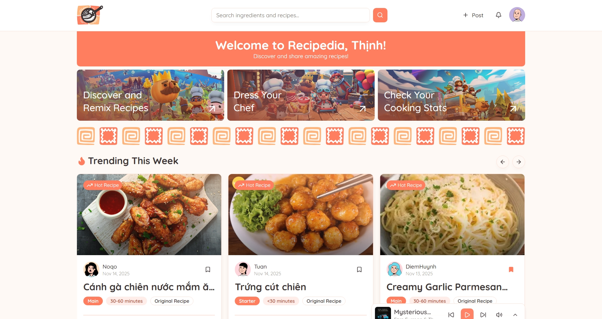
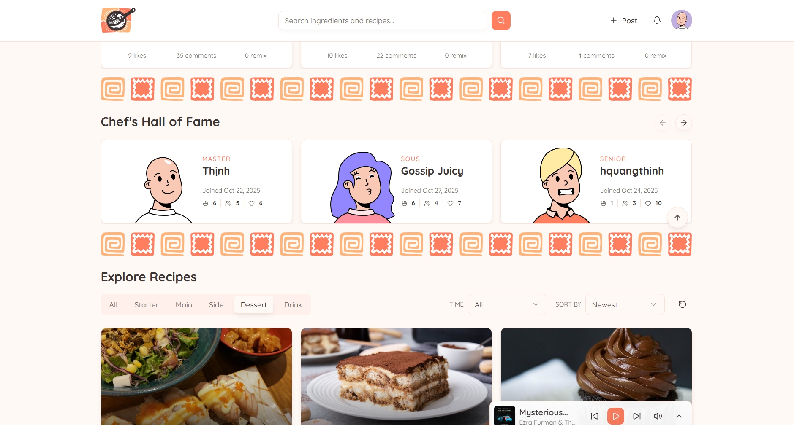
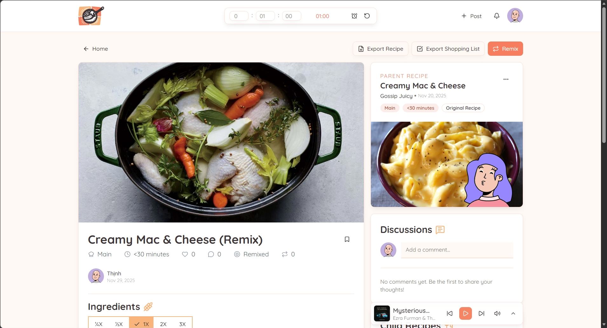
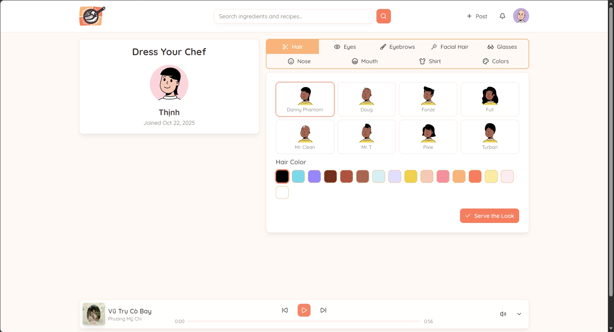
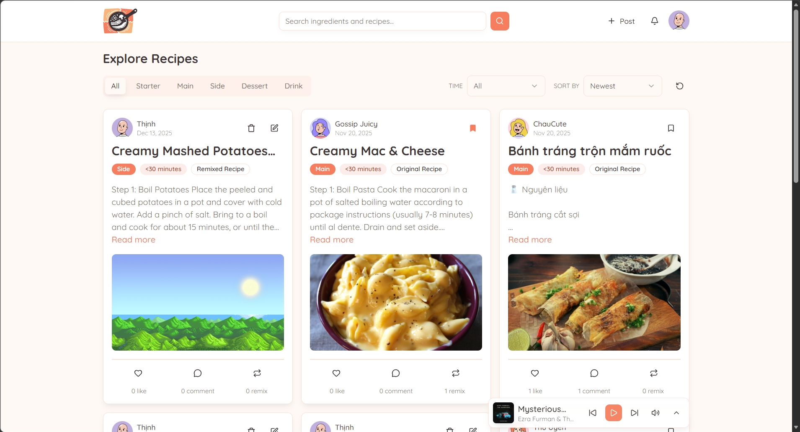
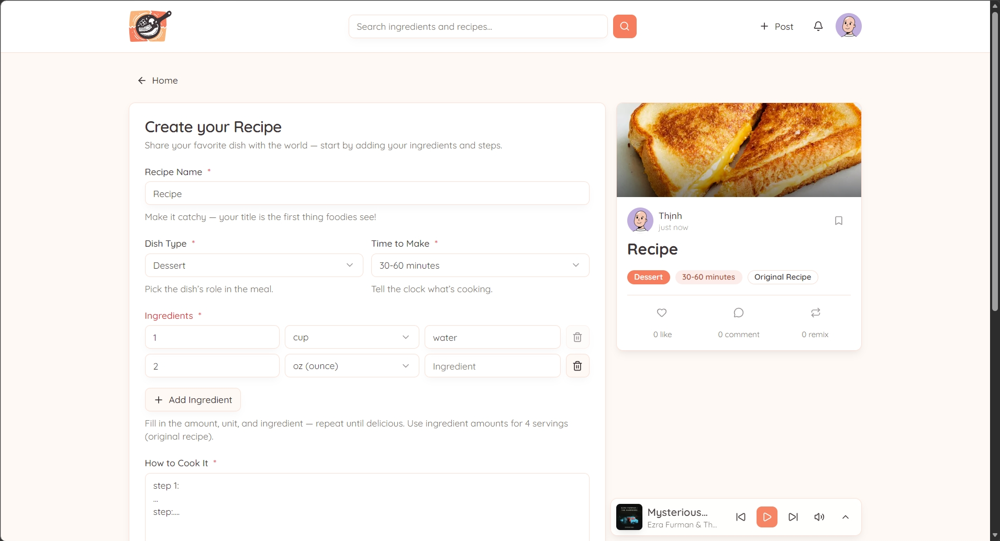
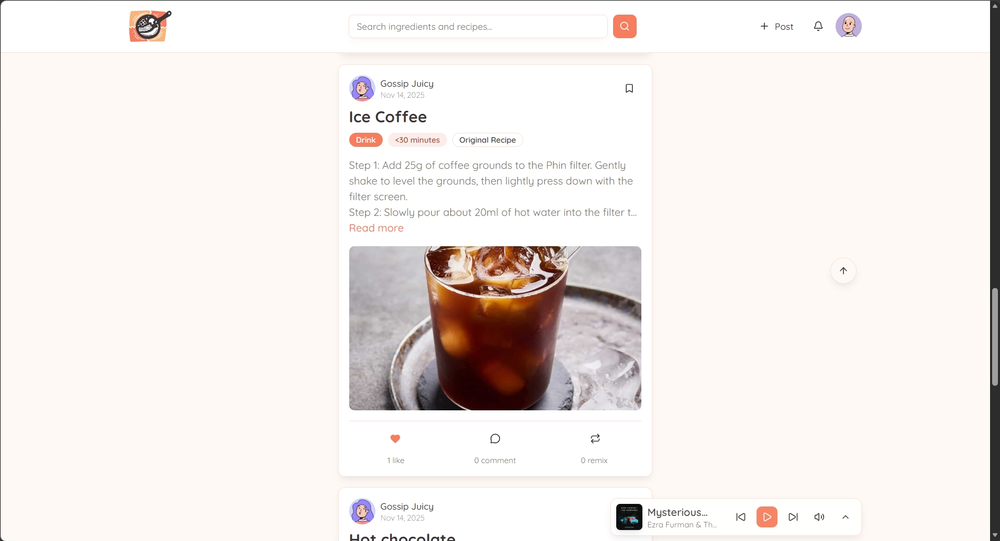

# Recipedia Frontend

The modern user interface for Recipedia, built with the latest web technologies to ensure a smooth, accessible, and beautiful user experience.

## Key Features

- **Modern UI/UX:** Built with Shadcn UI (Radix Primitives) and Tailwind CSS v4 for a polished look.
- **Data Visualization:** Interactive charts using Recharts and powerful data tables via TanStack Table.
- **Utilities:** Export recipes to PDF or Image.
- **Robust Forms:** Type-safe form handling with React Hook Form and Zod validation.
- **Responsive:** Fully optimized for mobile, tablet, and desktop devices.

## Demo

- Live: https://recipedia-frontend-omega.vercel.app/









## Tech Stack

### Core


 

### Routing


### Styling


### UI Components


### HTTP Client


### Utilities


## Installation

### Clone repo

```bash
git clone https://github.com/hquangthinh13/recipedia-frontend.git

cd project
```

### Install dependencies

```bash
npm install
```

## Environment Variables

```env
VITE_API_URL=YOUR_BACKEND_API_URL
```

## Run Project

### Development

```bash
npm run dev
```

### Production

```bash
npm run build
npm start
```

## Available Scripts

- `npm run dev`: Starts the development server.
- `npm run build`: Builds the app for production to the `dist` folder.
- `npm run preview`: Locally preview the production build.
- `npm run lint`: Runs ESLint to check for code quality.

## Deployment


